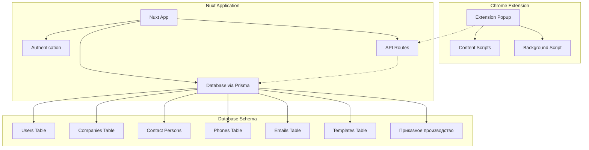

# Архитектура и план внедрения системы

## MVP Функции (Локальная разработка - без защиты)
1. **Локальная настройка Nuxt приложения**
   - Базовый проект Nuxt 4 с Prisma ORM
   - База данных MYysql
   - Аутентификация с Nuxt Auth Utils
   - Интеграция Tailwind CSS
   - Базовая функциональность страницы входа

2. **Скелет Chrome расширения**
   - Расширение на Vanilla JS с popup интерфейсом
   - Локальное хранилище для сохранения данных
   - Базовый UI с вкладками "Сбор данных" и "Получение данных"
   - Mock API вызовы для разработки (на базе example\Приказное производство.html)

3. **Реализация схемы базы данных**
   - Таблица пользователей с базовыми полями аутентификации
   - Таблица компаний с базовыми полями
   - Таблицы контактных лиц, телефонов, email
   - Базовая структура шаблонов SMS/email

4. **Функциональность отображения данных**
   - Базовое получение данных из локальной базы
   - Простой UI для отображения собранных данных
   - Фильтрация по CreatedAt/UpdatedAt

## Архитектура системы



## Детальный план внедрения

### Фаза 1: Настройка основного приложения
1. **Инициализация Nuxt проекта**
   - Создание Nuxt 3 проекта с TypeScript
   - Установка Prisma и настройка SQLite для разработки
   - Настройка Nuxt Auth Utils с локальной стратегией
   - Конфигурация Tailwind CSS

2. **Дизайн схемы базы данных**
```prisma
model User {
  id        Int                  @id @default(autoincrement())
  email     String   @unique
  password  String
  name      String?
  roles     String   @default("user")
  createdAt DateTime @default(now())
  updatedAt DateTime @updatedAt
  isDeleted Boolean  @default(false)
}

model Company {
  id          Int                  @id @default(autoincrement())
  name        String
  unp         String?
  createdAt   DateTime @default(now())
  updatedAt   DateTime @updatedAt
  isDeleted   Boolean  @default(false)
  contactPersons ContactPerson[]
  courtCases  CourtCase[] // Связь с приказным производством
}

model ContactPerson {
  id        Int                  @id @default(autoincrement())
  name      String
  company   Company @relation(fields: [companyId], references: [id])
  companyId Int
  phones    Phone[]
  emails    Email[]
  createdAt DateTime @default(now())
  updatedAt DateTime @updatedAt
  isDeleted Boolean  @default(false)
}

model Phone {
  id              Int                  @id @default(autoincrement())
  number          String
  contactPerson   ContactPerson @relation(fields: [contactPersonId], references: [id])
  contactPersonId Int
  createdAt       DateTime @default(now())
  updatedAt       DateTime @updatedAt
  isDeleted       Boolean  @default(false)
}

model Email {
  id              Int                  @id @default(autoincrement())
  address         String
  contactPerson   ContactPerson @relation(fields: [contactPersonId], references: [id])
  contactPersonId Int
  createdAt       DateTime @default(now())
  updatedAt       DateTime @updatedAt
  isDeleted       Boolean  @default(false)
}

model CourtCase {
  id                Int                  @id @default(autoincrement())
  uuid              String   @unique
  claimant          String   // Взыскатель
  claimantCompany   Company? @relation(fields: [claimantCompanyId], references: [id])
  claimantCompanyId Int
  debtor            String   // Должник
  debtorCompany     Company? @relation(fields: [debtorCompanyId], references: [id])
  debtorCompanyId   Int
  caseNumber        String?   // № дела
  incomingNumber    String   // Вх. №
  receiptDate       DateTime // Дата поступления
  debtAmount        Float    // Сумма долга
  decision          String   // Решение о принятии заявления
  courtName         String   // Наименование суда
  createdAt         DateTime @default(now())
  updatedAt         DateTime @updatedAt
  isDeleted         Boolean  @default(false)
}

model SmsTemplate {
  id        Int                  @id @default(autoincrement())
  name      String
  content   String
  createdAt DateTime @default(now())
  updatedAt DateTime @updatedAt
  isDeleted Boolean  @default(false)
}

model EmailTemplate {
  id        Int                  @id @default(autoincrement())
  name      String
  subject   String
  content   String
  createdAt DateTime @default(now())
  updatedAt DateTime @updatedAt
  isDeleted Boolean  @default(false)
}

model SentSms {
  id        Int                  @id @default(autoincrement())
  phone     String
  content   String
  template  SmsTemplate? @relation(fields: [templateId], references: [id])
  templateId Int?
  createdAt DateTime @default(now())
  updatedAt DateTime @updatedAt
  isDeleted Boolean  @default(false)
}

model SentEmail {
  id        Int                  @id @default(autoincrement())
  email     String
  subject   String
  content   String
  template  EmailTemplate? @relation(fields: [templateId], references: [id])
  templateId Int?
  createdAt DateTime @default(now())
  updatedAt DateTime @updatedAt
  isDeleted Boolean  @default(false)
}
```

3. **Система аутентификации**
   - Страница входа с базовой формой
   - Функциональность регистрации пользователя
   - Управление сессиями

### Фаза 2: Разработка Chrome расширения
1. **Структура расширения**
   - Manifest файл для Chrome расширения
   - Контент встраивается в HTML с базовой разметкой справой стороны
   - Content scripts для сбора данных
   - Background script для API коммуникации

2. **Локальное управление данными**
   - Chrome storage API для локальных данных
   - Базовый UI для сбора и получения данных
   - Mock API интеграция для разработки

### Фаза 3: Функции MVP
1. **Интерфейс сбора данных**
   - Базовая форма для ручного ввода данных
   - Простое хранение данных в локальной базе
   - Отображение данных с фильтрацией по дате

2. **Основа системы шаблонов**
   - Базовая структура SMS и email шаблонов
   - Простой интерфейс управления шаблонами

## Стек технологий
- **Frontend**: Nuxt 4, Vue 3, TypeScript
- **Стилизация**: Tailwind CSS
- **База данных**: Prisma ORM с SQLite (dev), Supabase (prod)
- **Аутентификация**: Nuxt Auth Utils
- **Chrome Extension**: Vanilla JavaScript, Chrome APIs
- **Деплой**: Supabase для базы данных, Vercel/Netlify для Nuxt app

## Структура файлов
```
project/
├── nuxt-app/
│   ├── prisma/
│   │   └── schema.prisma
│   ├── components/
│   ├── pages/
│   ├── utils/
│   └── nuxt.config.ts
├── chrome-extension/
│   ├── manifest.json
│   ├── popup.html
│   ├── popup.js
│   ├── content.js
│   └── background.js
└── README.md
```

## Приоритеты разработки
1. Настройка Nuxt приложения и базы данных
2. Базовая аутентификация
3. Chrome расширение с локальным хранилищем
4. Интерфейс сбора и отображения данных
5. Интеграция с Supabase для production

## Следующие шаги
Рекомендуется начать с настройки Nuxt приложения и проектирования схемы базы данных, затем перейти к Chrome расширению. MVP должен фокусироваться на локальной разработке без внешних API интеграций на начальном этапе.